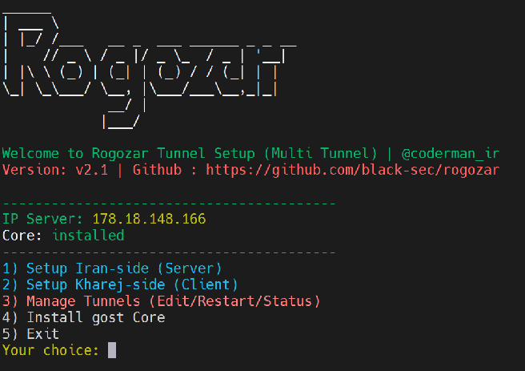

<h1 align="center" style="font-size: 2.5em; margin-bottom: 15px; color: #2c3e50;">Rogozar Tunnel Setup Script</h1>




[Persian Readme](https://github.com/black-sec/rogozar/blob/main/README_FA.md)


Introduction
Rogozar is a smart and flexible script designed for creating and managing multi-tunnels on Linux servers.
Unlike most traditional tools, Rogozar utilizes its own custom-built core (based on gost) to create multiple optimized tunnels simultaneously and intelligently switch between them. This ensures maximum stability, performance, and censorship bypassing capabilities.

Features
Multi-Tunnel architecture with 7 concurrent tunnels:

5 MWSS + Smux tunnels for different user load levels (adaptive & intelligent)

1 SSH tunnel for high-disruption scenarios

1 ICMP tunnel for bypassing heavy national firewalls

Smart core for automatic switching between tunnels based on network conditions and number of users

Supports both Iran-based and non-Iran (international) servers with dedicated configurations

Full tunnel management:

Create, edit, delete, and restart with a single command

Persistent tunnels using systemd services

Easy installation of the core and services

Displays the installation status of the core and server IP

Requirements
Operating System: Any Linux distribution (Ubuntu, Debian, CentOS, etc.)

Root or sudo access

Ports 8440 to 8446 must be free (used internally by Rogozar core)

How to Use
One-line installation:
```
bash <(curl -fsSL https://raw.githubusercontent.com/black-sec/rogozar/main/rogozar.sh)
```
Manual installation::

```
curl -fsSL https://raw.githubusercontent.com/black-sec/rogozar/main/rogozar.sh -o rogozar.sh
chmod +x rogozar.sh
bash rogozar.sh
```
Important Notes
Tunnel names must be unique.

Ports 8440 to 8446 are reserved by Rogozar’s core. Ensure they are not used by other services.

If a tunnel becomes unresponsive, use the Restart option in the menu.

When setting up the non-Iran (client) side, a public key will be generated.
You must place this key in /root/.ssh/rogozar.pub on the Iran-based server.

The installation status of the gost core is displayed at the top of the menu (red if not installed).

Menu Options
Option 1: Setup Iran-side (Relay Server)
Deploys all 7 tunnel types (5 MWSS, SSH, ICMP) on the Iran-based server.
⚠️ Ensure ports 8440–8446 are free.

Option 2: Setup Kharej-side (Client Server)
Prompts you to enter the IP/domain and ports of the Iran-based server.
Configures the client to intelligently connect to the smart tunnel core on the Iranian side.

Option 3: Manage Tunnels (Edit / Restart / Status)
Allows you to manage existing services: restart, modify, or view status of tunnels.

Option 4: Install gost Core
Installs the core (gost) if it’s not already present.
If GitHub is blocked, you can manually install the binary (see the guide below).

Option 5: Exit

Contact & Support
Developer:
https://t.me/coderman_ir

Telegram Channel:
https://t.me/rogozar_script

GitHub Project:
https://github.com/black-sec/rogozar

For suggestions or issues, open a ticket in the Issues section.

License
MIT License


